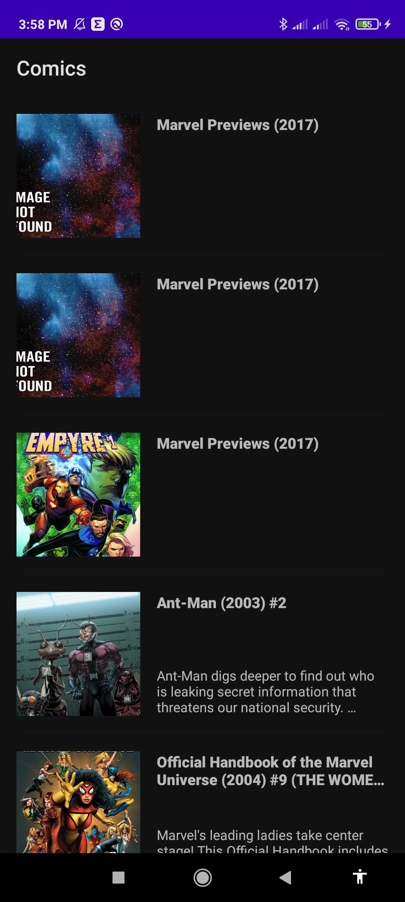
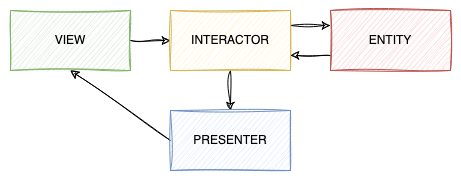
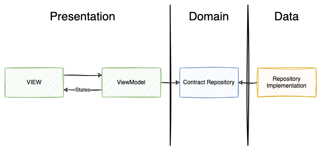

# Comics Challenge

Repositório com o código-fonte referente ao aplicativo para Android desenvolvido como parte do processo seletivo para a vaga de Desenvolvedor Sênior.

O desafio consistia na análise de um aplicativo que consome a API da Marvel para listagem de quadrinhos — originalmente desenvolvido utilizando a arquitetura VIPER — e a refatoração para a arquitetura considerada mais adequada pelo candidato. Dentro do desafio proposto, a arquitetura escolhida foi baseada em Clean Architecture com MVVM.



## Visão Geral do Desafio

O desafio proposto pela empresa como parte do processo seletivo consistia no aprimoramento do código do aplicativo, em concomitância com a manutenção de sua funcionalidade, observando as necessidades de melhoria da qualidade do código em diversos aspectos, dentre eles a escalabilidade, testabilidade e manutenabilidade.

O projeto apresentado para o desafio foi estruturado baseado na arquitetura utilizada no código legado do aplicativo da empresa, que já apresentava uma estrutura de código bem consolidada, contudo possuindo limitações e não atendendo as práticas atuais recomendadas pela comunidade. Portanto, alinhando esses fatores técnicos com uma possível necessidade do aplicativo em atender objetivos de negócio que visam a evolução do produto, são necessárias melhorias da qualidade e modificaçoes de código para mantê-lo atualizado com as tecnologias recentes utilizadas em projetos para o sistema Android.

Diante dos pontos supracitados, a arquitetura escolhida para substituir a vigente no aplicativo foi a MVVM. Por ser um padrão amplamente utilizado no mercado e possuir vasta referência técnica, atende bem as diversas necessidades identificadas para a evolução do projeto, principalmente a facilitação da curva de aprendizado da equipe, contribuindo com a ampliação futura dos times e a manutenção do objetivo de sempre manter o aplicativo atualizado com as tendências do mercado. Aliado ao uso da MVVM, foi utilizado o Clean Architecture, proporcionando assim maior flexibilidade ao código, tornando-o mais testável e escalável.

## Arquitetura Anterior (VIPER)

O VIPER (View, Interactor, Presenter, Entity and Router) é um padrão de arquitetura de desenvolvimento de software para desenvolver código modular, baseado no Clean Architecture. Mais informações podem ser encontradas [aqui](https://www.techtarget.com/whatis/definition/VIPER).

Como o aplicativo não necessita de navegação, por possuir apenas uma tela, a camada Router foi omitida. Abaixo, uma imagem que ilustra como estavam organizadas as camadas.



O código-fonte inicial também pode ser conferido [neste commit](https://github.com/pedrox-hs/marvel-comics-app/commit/75f2951439a04fe48d1e16b9cfd807cf7f75fc3a).

### Vantagens

Dentro da estrutura primariamente apresentada, apesar de identificar pontos para melhoria, tambem é possivel verificar vantagens já presentes no projeto.

O aplicativo apresenta certo grau de testabilidade, o que facilita o desenvolvimento de outros fatores por parte da equipe, garantindo o correto funcionamento das features já existentes. Além disso, a separação de responsabilidades no código auxilia na manutenção e possíveis alterações necessárias e traz clareza de compreensão do que necessita ser realizado nos códigos do aplicativo. Por fim, uma das maiores vantagens se da na familiaridade para desenvolvedores que vem de outra tecnologia, como o Swift no iOS, que conseguem facilmente compreender, pois podem lidar com uma arquitetura já previamente conhecida por eles, e se adaptar as necessidades da linguagem utilizada no app.

### Desvantagens

Atendendo a principal proposta do desafio, foram identificados alguns problemas presentes na arquitetura do aplicativo. 

#### Dependência cíclica

O ponto mais evidente em dissonância com os objetivos do app é a dependência cíclica entre a View e o Presenter, o que gera um possível Memory Leak, causando ao usuário uma má experiência de usabilidade, pois o aplicativo acaba por consumir mais recursos que o necessário para seu funcionamento.

```kotlin
    private val interactor: Interactor = Interactor(Presenter(this))
```

Uma maneira de evitar esse problema seria realizar a liberação da referência da View contida no Presenter antes da mesma ser destruída.

#### Limitação do VIPER em projetos Android

Outro ponto presente é que o uso do padrão VIPER não se faz recomendado para projetos em Android, visto que existem outras alternativas desenvolvidas para atender de forma mais efetiva as necessidades da plataforma; isso fica claro na maneira com que o VIPER interage com as camadas, dificultando uma possível evolução da View para utilização do Compose ao invés do ViewBinding. 

### Inversão de Controle

Diante disso, pela forma como o padrão VIPER foi implementado, fica evidente também um acoplamento por falta de estratégia de inversão de controle, comumente atendida utilizando ferramentas de injeção de dependências, que até então não estavam sendo utilizadas pelo projeto.

```kotlin
class Repository {
    suspend fun getComics() = Retrofit.Builder()
        .baseUrl("https://gateway.marvel.com/v1/public/")
        .addConverterFactory(GsonConverterFactory.create())
        .build().create(Api::class.java).getComics(
            apikey = "API_KEY",
            ts = "TS",
            hash = "HASH"
        ).await()
}
```

## Clean Architecture

<!-- Introduza o conceito de Clean Architecture e MVVM (Model-View-ViewModel) e explique por que essa abordagem foi escolhida para a refatoração. Destaque as principais vantagens da Clean Architecture, como a separação de responsabilidades e a facilidade de teste. -->

Clean Architecture é um padrão de design de software que visa separar claramente as diferentes preocupações e responsabilidades de um sistema, resultando em um código altamente modular, independente de frameworks externos e de fácil manutenção. Ele foi proposto por Robert C. Martin como uma maneira de criar sistemas que permaneçam flexíveis e evoluam de forma sustentável ao longo do tempo.

### Vantagens do Clean Architecture:

- **Separação de Responsabilidades:** A arquitetura organiza o código em camadas distintas, cada uma com sua própria responsabilidade bem definida. Isso facilita a manutenção, testabilidade e reutilização do código.

- **Independência de Frameworks:** O código nas camadas internas é independente de qualquer framework externo. Isso protege o núcleo da aplicação de mudanças externas, tornando-o mais estável e duradouro.

- **Facilidade de Testes:** As camadas internas contêm a lógica de negócios e são facilmente testáveis, pois não dependem de interfaces gráficas ou outras partes mais complexas da aplicação.

## MVVM (Model-View-ViewModel)

MVVM é um padrão de arquitetura de software que se concentra na separação de preocupações entre a interface do usuário e a lógica de negócios subjacente. Ele ajuda a criar aplicativos mais organizados e testáveis, promovendo a reutilização de código e facilitando a colaboração entre desenvolvedores.

### Vantagens do MVVM:

- **Separação Clara:** O MVVM divide o código em três componentes principais: Model, View e ViewModel. Isso permite que cada componente tenha uma responsabilidade específica, tornando o código mais compreensível e fácil de manter.

- **Testabilidade Aprimorada:** A lógica de apresentação é colocada principalmente na ViewModel, que é independente da interface do usuário. Isso facilita a escrita de testes unitários para verificar o comportamento da lógica.

- **Reatividade:** O MVVM muitas vezes é implementado em conjunto com bibliotecas de reatividade, como o "Data Binding" no Android. Isso permite que as alterações nos dados sejam automaticamente refletidas na interface do usuário, simplificando a sincronização entre os componentes.

Ambos o Clean Architecture e o MVVM têm a intenção de tornar o desenvolvimento de software mais organizado, modular e sustentável, proporcionando benefícios significativos em termos de manutenção, testabilidade e escalabilidade.

## Mudanças Realizadas

Antes de fazer quaisquer alterações e trazer mais segurança durante o processo, garantindo que nenhuma feature deixe de funcionar, foi necessário atualizar os testes unitários e incluir os testes instrumentados. Após garantir que temos um ambiente seguro para iniciar a refatoração, o processo foi aplicado simulando um ambiente real de contribuição, onde os desenvolvedores poderiam revisar e acompanhar de forma mais clara e objetiva as mudanças realizadas gradualmente dentro da aplicação.

De acordo com as mudanças implementadas, a organização dos pacotes se deu da seguinte forma:



> Todo o processo de refatoração também pode ser detalhadamente conferido nos [commits](https://github.com/pedrox-hs/marvel-comics-app/commits/main), onde foi mantida a ordem que cada etapa foi realizada.

### 1. Apresentação (View e ViewModel)

Após a reorganização das partes, a View ficou responsável apenas em reagir aos estados emitidos pela ViewModel que, por sua vez, substituiu o Presenter, não sendo mais necessário seu uso para orquestrar os comportamentos da View. Foi eliminada também a necessidade do Interactor — que servia como uma espécie de ponte entre a View e o Presenter e interagia com a camada de dados. A partir de entáo, a ViewModel passa a interagir diretamente com a camada de domínio.

### 2. Camada de Domínio

Idealmente, a camada de domínio possui os UseCases, entidades e contratos dos repositórios. Por se tratar de uma regra simples, foi omitido o uso do UseCase pois o contrato de comunicação entre as camadas pode ser garantido com a interface do repository, simplificando assim o entendimento por desenvolvedores com menos experiência nesse tipo de arquitetura.

### 3. Camada de Dados

Dentre todas, foi a camada que mais necessitou da realização de mudanças, sendo dividida sua responsabilidade com o DataSource, deixando-o agnostico ao que foi necessário para instanciar o Cliente HTTP. Além disso, sendo a regra de autenticação com a API comum à todas as requisições que poderiam ocorrer, foi extraído o uso da `API Key`, `TS` e `Hash` para o interceptor `ComicApiAuthInterceptor`, garantindo assim que nenhuma requisição precise replicar a maneira de autenticar com a API.

### 4. Injeção de Dependência

Para facilitar ainda mais o desacoplamento entre as camadas, utilizou-se o Koin como ferramenta para aplicar a inversão de controle e injeção de dependências. Atualmente, o Koin já suporta a geração automática dos módulos de definições apenas utilizando `annotations` e KSP (Kotlin Symbol Processor), algo que garante a correta definição e suprimento das dependências em tempo de compilação.

## Tecnologias Utilizadas

- [Jetpack ViewModel](https://developer.android.com/topic/libraries/architecture/viewmodel) facilita a aplicação do padrão MVVM em aplicativos Android; 
- [Coroutines](https://kotlinlang.org/docs/coroutines-overview.html) para chamadas assíncronas à API;
- [Retrofit](https://square.github.io/retrofit/) à frente do [OkHttp](https://square.github.io/okhttp/) para fazer requisições HTTP;
- [Glide](https://bumptech.github.io/glide/) para exibição das imagens remotas;
- [Koin](https://insert-koin.io/) para aplicar o conceito de inversão de controle;
- [MockK](https://mockk.io/) auxilia nos testes unitários;
- [Espresso](https://developer.android.com/training/testing/espresso) para os testes instrumentados de interface;
- [MockWebServer](https://github.com/square/okhttp/tree/master/mockwebserver) para mockar as requisições para validar a serialização e deserialização dos dados.

## Próximos Passos

Da forma como o código foi organizado, mediante maior tempo hábil para desenvolvimento, haveriam outras possibilidades diversas de evoluções, tais como:

- **Modularização da Aplicação:** fragmentar o módulo `app` em módulos menores visando facilitar o trabalho entre um número maior de desenvolvedores através do reaproveitamento do código, melhorando o tempo de compilação em caso de grande crescimento do code base;

- **Migração da UI:** substituição da biblioteca utilizada para construir os layouts, passando a utilizar Compose, que é toolkit de UI atualmente recomendado; 

- **Cache Local:** inclusão de mais um DataSource para guardar dados localmente utilizando o Room, tornando possível a utilização do app mesmo estando offline.

## Execução do Projeto

### Ambiente

- Android Studio Giraffe
- Java 17

### Testes

```
# Unitários
./gradlew test

# Instrumentados
./gradlew connectedDebugAndroidTest
```

### Execução

```
./gradlew assembleDebug

adb install app/build/outputs/apk/debug/app-debug.apk

adb shell am start -n com.example.comics/.MainActivity
```

## Considerações Finais

Conclui-se, portanto, que a arquitetura escolhida e aplicada ao projeto proposto contribui com a solução dos diversos conflitos localizados, bem como a melhoria dos pontos que já se encontravam em convergência com os objetivos da empresa dentro do desafio oferecido. Diante das soluções apresentadas neste projeto, fica clara a capacidade de crescimento por parte do aplicativo mediante aplicação das melhorias sugeridas.

Ao término, agradeço a oportunidade e confiança em participar do processo seletivo e de aprimorar meus conhecimentos através do desafio apresentado. Espero e desejo poder contribuir em consonância com os ideais e aspirações futuros da empresa, dedicando-me na melhoria e evolução constante do aplicativo para os usuários e para o time desenvolvedor do qual terei grande satisfação em fazer parte.
